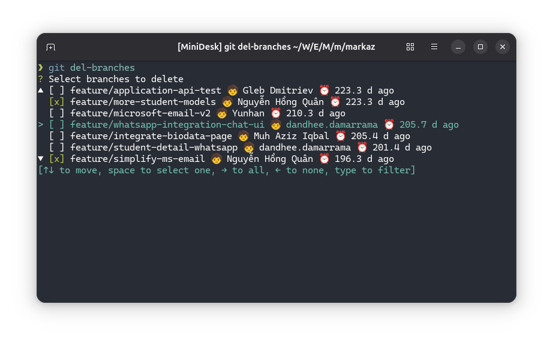

# git-del-branches

[](https://crates.io/crates/git-del-branches)

Tool to select and delete multiple Git branches.

## Install

```console
$ cargo install git-del-branches
```

## Usage

Run this command inside your Git working folder:

```console
$ git-del-branches
```

Or if you have `git` installed:

```console
$ git del-branches
```



Terminal screencast:

[](https://asciinema.org/a/723705)

## Credit

- [Nguyễn Hồng Quân](https://quan.hoabinh.vn)
